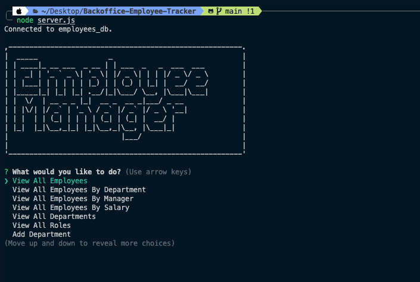

# Backoffice-Employee-Tracker 	  

## Table Of Contents
- [Description](#description)
- [Installation](#installation)
- [Usage](#usage)
- [Contributing](#contributing)
- [License](#license)
- [Tests](#tests)
- [Questions](#questions)

# Description
A terminal based app for tracking employees and data related to them.

# Installation
To run the database open the terminal and run the command "node server.js". This will start the employee tracker. You will be able to select from a series of options including 'View All Employees By Department', 'View All Employees By Manager', 'View All Employees By Salary', 'Add Employee', 'Remove Employee', 'Update Employee Role', 'Update Employee Manager', and 'Quit'.

# Usage
Use the employee tracker to add new employees to the database, assign their managers/departments/roles, as well as update and delete employees.

https://drive.google.com/file/d/1uMhi7XRnALmZMU9ToLrqEsjKLBZQPUg8/view

# Contributing
This project was completed using strictly class materials and activities as well as postgreSQL documentation from here: 
https://www.postgresql.org/files/documentation/pdf/17/postgresql-17-US.pdf

# License
MIT

# Tests
All testing was performed in the terminal and using Insomnia.

# Questions
[GitHub Profile](https://github.com/SDKwapis)
For questions or comments please reach out to me at: sdkwapis@gmail.com